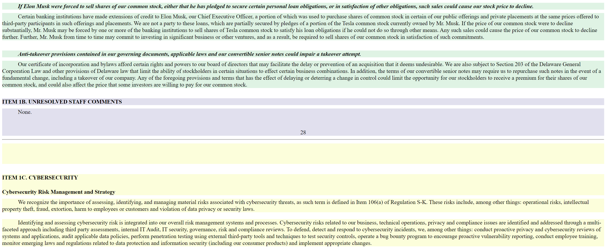

Python package that parses SEC filings. So far can only parse 10-K Annual Reports.


[Parsed Tesla XML File](Assets/tsla_parsed_10k.xml)

Installation: (will change to proper index)
```
pip install -i https://test.pypi.org/simple/ sec-parsers==0.2
```

Quickstart:
```
from sec_parsers import parse_10k
xml = parse_10k(10k_html, visualize=True)
```

For an example look at example.ipynb.

Why SEC 10-K's are hard to parse:
* They are unstandardized. For example, subsection extraction (e.g. Seasonality) is hard to do because while these subheadings look normal to humans, in html they are quite complicated. e.g. a mess of bold tags vs css, sometimes a subheading is a table, sometimes the first letter is unbolded, but the rest is bolded.

How the 10-K parser works:
1. Find table of contents.
2. Use links in table of contents to find item elements.
3. Extract text between items.

Current Features:
* Convert sec 10k html to xml.
* Visualize how parser works.

Future Features:
* Richer xml file with subheading nodes. If you want to see my tests to do this look in Screenshots / older code (html_parser.py).
* More Parsers.
* Better error handling.

Note that this package is a work in progress. Some documents will not parse correctly, which is why I added visualization features.

Why I made this project:
I wanted to learn how to use Python's Beautiful Soup Library, as well as to understand how unstructured text can be stored in html documents.

Some things I learned:
1. I have a suspicion that some company/contractor that submits sec filings is intentionally making SEC filings hard to machine read.
2. Beautiful Soup documentation has a lot of deprecated functions.
```
    findNextSiblings = find_next_siblings   # BS3
    fetchNextSiblings = find_next_siblings  # BS2
```

