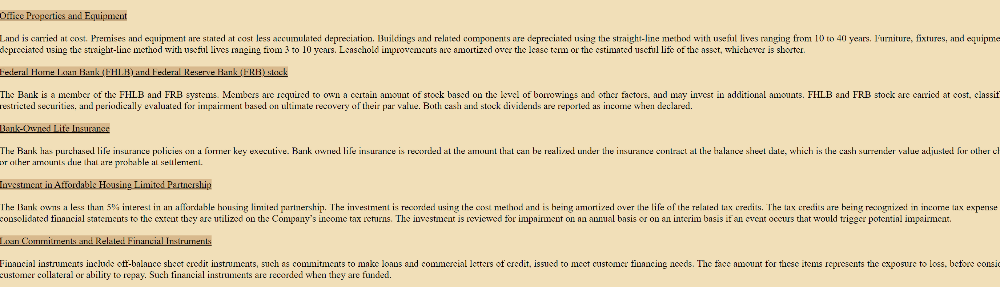

Project to learn how to use Python's Beautiful Soup Library, as well as to understand how unstructured text can be stored in html documents.

This project was difficult due to the extreme lack of standardization, followed by complications such as one element of a word being unbolded and the rest being bolded. I suspect that some of the complications are a deliberate attempt by companies / the filing contractors to make it harder to machine read the filings.

Currently the project has multiple iterations of parsers
1. parsers based on text only, with a tool to help check if parsing is mostly correct
2. parsers based on elements using decompose
3. parsers based on element implementing highlighting
4. parsers based on iterating through the tree recursively, and simplifying the html [current]

Each iteration of the parsers reflects my better understanding of how to use beautiful soup.





Notes on BeautifulSoup:
* duplication of functions. Looking up resources online to mixed results, better to just read original code.
```
    findNextSiblings = find_next_siblings   # BS3
    fetchNextSiblings = find_next_siblings  # BS2
```

Differences between this parser and others:
1. Most parsers use regex to identify specific sections. This works well, except it does not allow accessing the rich unstandardized subsection data

TODO:

Update 6/6 - Use table of contents. We need a good parser to first grab table of contents, and then inject classes into linked tags
use to anchor for xml. TOC PARSE -> Highlight -> XMLs

we probably will want to use table of contents links to guide xml process

html parser - does not look at context
xml parser - does + adds visualization

Important to keep functions that use context seperated from those that do not

Looks like tables for headers works ok, table parsing detection for numeric is not the best, but can be skipped for now
we probably need headers with more details

